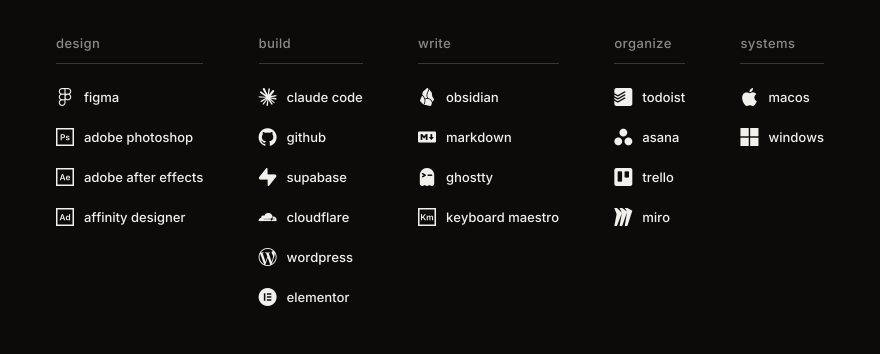

graphic designer and operations manager at a land surveying firm.

## what i do
i run the back office end to end: schedules, field crews, documents, finances. and i build the tools that keep it running: automations, dashboards, internal sites, scripts.

## how
every process written down, every decision recorded. ai is a working partner (claude code), not a shortcut. design gives the form; systems give the rhythm.

## languages
<table>
<tr><th width="518" align="left">language</th><th width="316" align="left">proficiency</th></tr>
<tr><td>portuguese (pt-BR) &nbsp;🇧🇷</td><td>native</td></tr>
<tr><td>english (en-US) &nbsp;🇺🇸</td><td>advanced</td></tr>
<tr><td>korean (ko-KR) &nbsp;🇰🇷</td><td>learning</td></tr>
</table>

## tools

## contributions

## listening
what's on repeat lives on [stats.fm](https://stats.fm/ndndnjdd).
