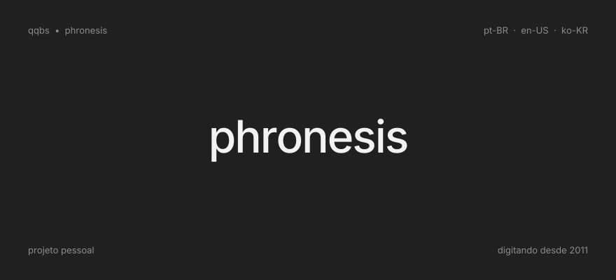

Graphic designer and operations manager at a land surveying company. Into linguistics, philosophy, technology and management.

## Team of one
I build systems on macOS and work with dedicated artificial intelligence. It is a solitary journey, true, but a full one: whole, and my own.

## Strengths
- **Organization.** Documented processes and recorded decisions; nothing left loose, ever.
- **Technology.** I test, integrate and automate whatever shortens the path and improves the result.

## Languages
<table>
<tr><th width="518" align="left">Language</th><th width="316" align="left">Proficiency</th></tr>
<tr><td>Portuguese (pt-BR) &nbsp;🇧🇷</td><td>Native</td></tr>
<tr><td>English (en-US) &nbsp;🇺🇸</td><td>Advanced</td></tr>
<tr><td>Korean (ko-KR) &nbsp;🇰🇷</td><td>Learning</td></tr>
</table>

## Tools
`wordpress` &nbsp; `markdown` &nbsp; `obsidian` &nbsp; `supabase` &nbsp; `cloudflare` &nbsp; `github` &nbsp;
`photoshop` &nbsp; `affinity designer` &nbsp; `claude` &nbsp; `windows` &nbsp; `macos`

## Contributions

